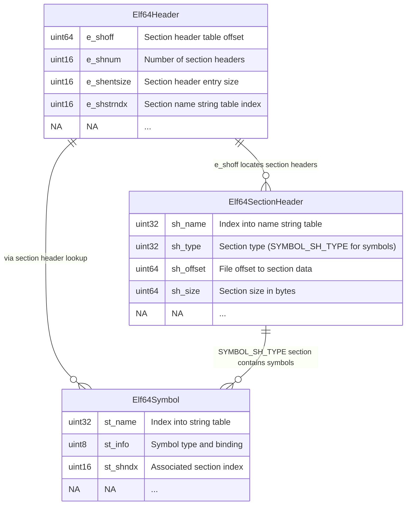

# Finding Mono Root Domain (Linux)

## Roadmap

In this section of the guide we will execute a series of linux commands to eventually get the pointer to mono_root_domain of a hackmud process, which is necessary for reading the memory of a mono application.

here's a rough roadmap of what we need to do:

1. Locate the hackmud process ID(s)
2. Read the process memory maps from /proc
3. Identify the libmonobdwgc shared library sections
4. Parse the ELF binary to locate symbols
5. Extract the `mono_get_root_domain` function address

## Getting PID

Let's start with the Process IDs

```bash
ps aux | grep -v grep | grep hackmud
```

```bash
username@hostname:~$  ps aux | grep -v grep | grep hackmud
username      7738 15.2  3.3 6489560 550288 ?      Sl   Jul26 173:58 /home/username/.steam/debian-installation/steamapps/common/hackmud/hackmud_lin.x86_64
username    137363 44.5 16.2 9290812 2658944 ?     Rl   Jul26 485:17 /home/steam/.local/share/Steam/steamapps/common/hackmud/hackmud_lin.x86_64 -batchmode -silent-crashes -logFile /dev/null -windowed -w 8 -h 8 -si
```

I have 2 hackmud instances running. One was launched from the desktop and another was launched in a docker container.
We need to parse the strings to get PIDs 7738 and 137363.

::: tip
Use this function to execute shell commands in TypeScript

```ts
import { exec } from "child_process";
import { promisify } from "util";
const execAsync = promisify(exec);
const res = await exec("ps aux | grep -v grep | grep hackmud");
```

:::

## What is proc

::: info AI
The /proc/[PID] directory is a virtual filesystem that exposes runtime information about a specific process as files. The kernel dynamically generates these entries, allowing you to inspect a process's state using standard file tools.

Key subdirectories/files include:

- maps – The process's memory map, showing loaded libraries, heap, stack, and their address ranges.
- environ – The environment variables passed to the process at launch.
- mem – Direct access to the process's virtual memory (requires appropriate permissions to read/write).
- cmdline – The exact command used to start the process.
- fd/ – A directory listing all open file descriptors and their targets.
- exe – A symbolic link to the actual executable binary on disk.
- status – Human-readable summary including PID, memory usage, and state.
  :::

## Reading the maps

We need to read the proc maps to find the mono library.

```bash
cat /proc/${pid}/maps
```

```bash
username@hostname:~$ cat /proc/7738/maps
00200000-00201000 r--p 00000000 08:02 36342038 /home/username/.steam/debian-installation/steamapps/common/hackmud/hackmud_lin.x86_64
00201000-00202000 r-xp 00001000 08:02 36342038 /home/username/.steam/debian-installation/steamapps/common/hackmud/hackmud_lin.x86_64
00202000-00203000 r--p 00002000 08:02 36342038 /home/username/.steam/debian-installation/steamapps/common/hackmud/hackmud_lin.x86_64
00203000-00204000 rw-p 00003000 08:02 36342038 /home/username/.steam/debian-installation/steamapps/common/hackmud/hackmud_lin.x86_64
0e27b000-12140000 rw-p 00000000 00:00 0 [heap]
4057c000-4058c000 rwxp 00000000 00:00 0
413d3000-4168e000 rwxp 00000000 00:00 0
7c2404000000-7c2404021000 rw-p 00000000 00:00 0
7c2404021000-7c2408000000 ---p 00000000 00:00 0
7c240b000000-7c240c021000 rw-p 00000000 00:00 0
7c240c021000-7c2410000000 ---p 00000000 00:00 0
7c2410000000-7c2410021000 rw-p 00000000 00:00 0
...
```

::: warning
Reading `/proc/[pid]/maps` and `/proc/[pid]/mem` typically requires root privileges
or the same user as the process. For the docker container instance, ensure you have
appropriate permissions.
:::

Parse every line and extract the following values:

- start - 00200000
- end - 00201000
- path - /home/username/.steam/debian-installation/steamapps/common/hackmud/hackmud_lin.x86_64

For now we will only need the libmonobdwgc map, but later on we will need all of them.

As you can see there are 4 memory mappings for libmonobdwgc-2.0.so.
**We need the first executable section (r-xp)**. The `r-xp` segment contains the actual machine code we need to disassemble.

```bash
username@hostname:~$ cat /proc/7738/maps | grep libmonobdwgc
7c2586600000-7c25869a1000 r-xp 00000000 08:02 36570016                   /home/username/.steam/debian-installation/steamapps/common/hackmud/hackmud_lin_Data/MonoBleedingEdge/x86_64/libmonobdwgc-2.0.so
7c25869a1000-7c2586ba1000 ---p 003a1000 08:02 36570016                   /home/username/.steam/debian-installation/steamapps/common/hackmud/hackmud_lin_Data/MonoBleedingEdge/x86_64/libmonobdwgc-2.0.so
7c2586ba1000-7c2586bab000 r--p 003a1000 08:02 36570016                   /home/username/.steam/debian-installation/steamapps/common/hackmud/hackmud_lin_Data/MonoBleedingEdge/x86_64/libmonobdwgc-2.0.so
7c2586bab000-7c2586bad000 rw-p 003ab000 08:02 36570016                   /home/username/.steam/debian-installation/steamapps/common/hackmud/hackmud_lin_Data/MonoBleedingEdge/x86_64/libmonobdwgc-2.0.so
```

## Parsing the ELF file

[Executable and Linkable Format](https://en.wikipedia.org/wiki/Executable_and_Linkable_Format) (ELF) is a very well documented format. You can read about it on a linked page. To keep the guide short I will only explain the basics.

You can either follow the Wikipedia article to write your own parser or you can install something like elfy js or any other library. However I couldn't get it to work the way I wanted so I wrote my own parser. I recommend you to do the same.

Here's what we need to do:

1. Open this file `/proc/${pid}/mem`
2. Skip to the start of the map (0x7c2586600000 from an example above)
3. Start by reading bytes at the start. That is our ELF file header. The ELF header is 52 or 64 bytes long for 32-bit and 64-bit binaries, respectively.
4. Jump to e_shoff (section header offset) and read e_shnum (number of entries in the section header table) sections headers. Each has a size of e_shentsize (size of a section header table entry)
5. Use e_shstrndx (section header string index. Basically sections[e_shstrndx]) to read section header names form strings section
6. Find a symbol section and read all symbols
7. Read the name for each symbol form strings section

Elf file contains a lot of information be we are only interested in symbols.




## Conclusion

This was the easy part (:

You now have the pointer to a mono_get_root_domain function that returns a [pointer](https://github.com/Unity-Technologies/mono/blob/7907d982772c47a9a1c7b676bead1eab1a276825/mono/metadata/domain.c#L964)

```c
mono_get_root_domain (void)
{
  return mono_root_domain;
}
```

When reading the next 8 bytes and disassembling them we get this:

```hex
# 0: 48 8b 05 fc 11 44 00   mov rax, qword ptr [rip + 0x4411fc]
# 7: c3                       ret
```

In the next part of the guide we will dive into the madness that is parsing mono structures!
