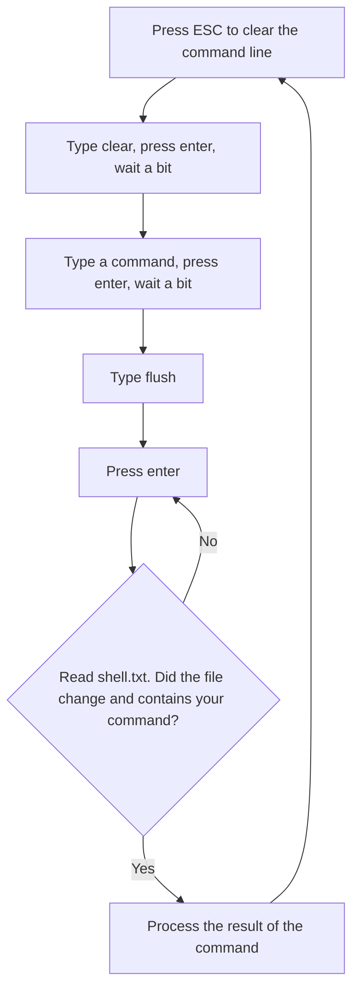

# Flushing the terminal

This page explains how you can implement an OOG without reading the memory. You may skip this if want to get to the good parts. I just think that it's good to explain this process to provide some context

## Flush

The `flush` command dumps the contents of the terminal into `shell.txt`. It is a reserved keyword and it executes instantly.

```hackmud
>>flush
Window contents have been written to disk successfully.
C:\Users\Ruslan_Taranov\AppData\Roaming\hackmud\shell.txt
```

Here's one way to use `flush` to sequentially execute commands



Here's a demonstration of this process.

1. Getting the corp scripts
2. Calling each one until it says that the scan is complete


## Limitations

There are several problems with this approach.

Sometimes if the game lags or if you don't wait long enough you will end up with

```hackmud
>>your.scriptflush
# or
>>clearyour.script
# or some other variation
```

If this happens, your script will not be executed and/or you will fail to get the output in a text file. You'll need to create timeout logic to escape these deadlocks. For example, if a `shell.txt` file doesn't update for long enough that means you are stuck somewhere. Where? You don't know and can't know. Your only way of communication with the game is a `shell.txt` file. In this situation you can wait a bit, and type flush again.

Another problem is hardline entering. During this process you can't type commands. To enter a hardline, type `kernel.hardline`, wait a bit, start spamming 1234567890 to enter the numbers on the screen, wait a bit, type flush to verify that you can type commands again. If at any step of this process something goes wrong you once again need to implement timeout logic to retry whatever you were doing.

Here's a list of things you can't do with the flush method

- Know if the terminal is currently processing a command
- Get the contents of the shell without typing anything
- Get the hardline timer or any other hardline game state parameters

## Conclusion

While this method does have limitations, they are not so bad. You can find workarounds for all of them. In fact, before writing `hacked mud` I used this method and achieved very good results. Memory reading is a flex. It is for power users. It is for cases when 90% stability is not enough and you need the full 100%.
