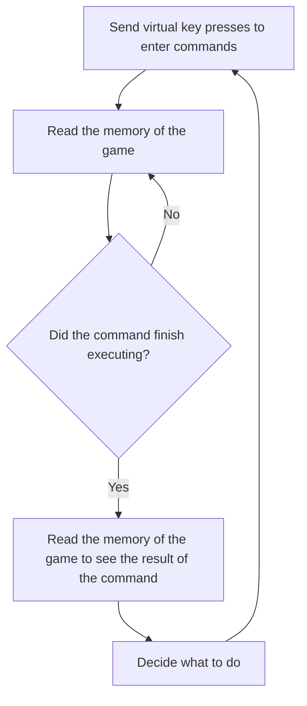

# Problem and solution

## Problem

For those who don't know, [hackmud](https://hackmud.com/) is an MMO where you write scripts in JS to automate almost every aspect of the game and also hack NPCs and other players (it is amazing, go get it!).
Some parts of the game are very easily to automated while others are next to impossible.

There are 3 ways to execute actions in the game

1. You run commands in the game terminal and get a response.

   ```hackmud
   >>accts.balance
   131B947M886K515GC
   
   ```

2. You make scripts that execute multiple commands for you

   ```hackmud
   >>cake.inv

    ╔════════════════════════════════════╗    
    ║  cake.inv - specs                  ║    
    ╠════════════════════════════════════╣    
    ║                                    ║    
    ║  hardline_count: 12                ║    
    ║  slots: 116/256                    ║    
    ║  loaded: 60/64                     ║    
    ║  user: cake                        ║    
    ║  balance: 131B947M886K515GC        ║    
    ║                                    ║    
    ╚════════════════════════════════════╝    

    ╔════════════════════════════════════════════════════════════════════
    ║  cake.inv - All my good stuff                                      
    ╠════════════════════════════════════════════════════════════════════
    ║                                                                    
    ║  000 chars      [1836]                064 k3y_v2     nyi5u2        
    ║  001 chars      [2551]                065 k3y_v2     nyi5u2        
    ║  002 chars      [2440]                066 k3y_v2     nyi5u2        
    ║  003 chars      [2400]                067 k3y_v2     nyi5u2        
   ```

3. You put your script on a cron bot.

Crons are very speed limited and fragile

- An average cron bot can execute a script every 10 minutes and it runs for 5s.
- if it runs more than 5s it will time out and unload itself.
- You only get one cron per user.
- You have to pay a fee every time a cron runs.
- Crons can't automate some parts of the game.

However you, as a player, can execute any number of commands and can perform task sequentially. You are only limited by server response time and script execution time.

That means you can't really automate all actions of the game. You either have to wait for your crons and work around the 5s runtime constraints or sit and grind.

## Solution

We can keep a hackmud window open and simulate keyboard key presses! We need to imitate a player.

The loop is:



::: tip Note
This is not the only way to do this. You can also use the `flush` command to dump the contents of the terminal into the shell.txt file instead of reading memory. It works and can actually be enough for most players but it does have its limitations. If you don't want to implement memory reading consider [flushing the terminal](flush)
:::

This way we will can achieve quite a lot of things in the game. We can automate:

- corp scraping
- hardline entering
- NPC breaching
- loot filtering
- and anything else your heart desires

If you know a thing or two about hacking you may say

> But why do all of this when you can just decompile the game and find the networking logic and just talk to the game server directly?

Nah-uh-uh! Not allowed by the game developer! People did get banned for doing this.

Now that we see the task at hand let's finally get to the point!
